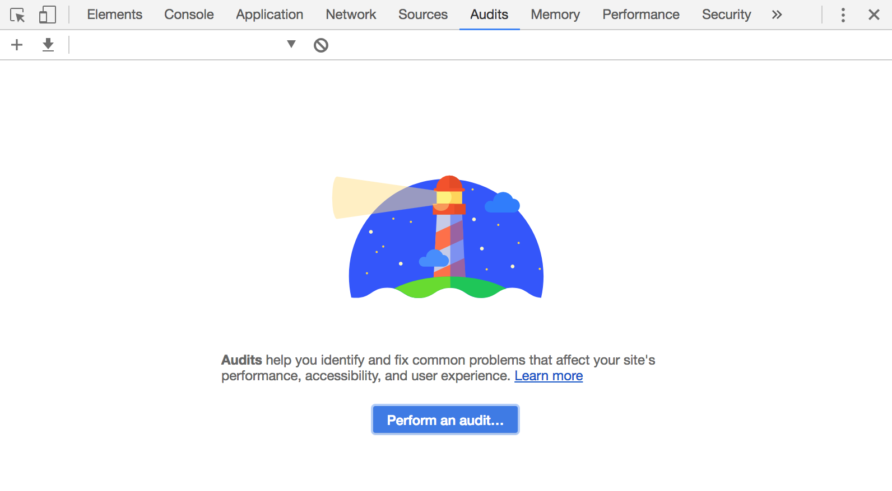
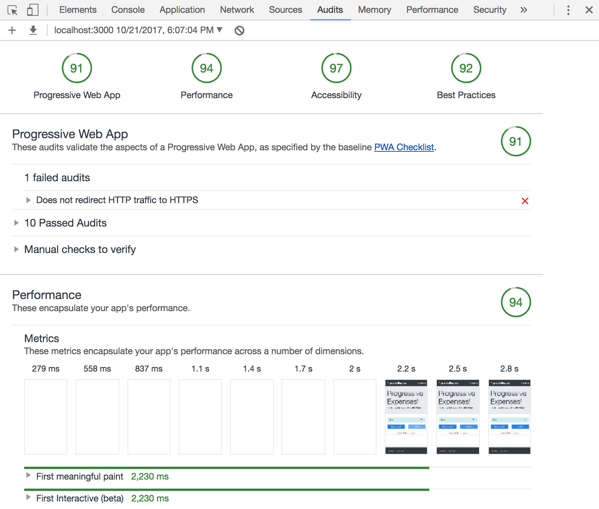

# 9. Herramientas
Existen varias herramientas que pueden ayudarnos a construir, probar y optimizar nuestra PWA.

## Automatizar SW con workbox
Lo primero que podemos hacer es automatizar la construcción de nuestro service worker.

[](https://workboxjs.org/)

Workbox es una colección de librerías y herramientas que simplifica el almacenamiento de archivos locales en websites. Deberías considerar usar Workbox si quieres:
- Hacer que tu sitio funcione offline.
- Mejorar la performance en visitas repetidas de usuarios. Incluso si no quisieras funcionar 100% offline, puedes usar Workbox para almacenar y servir archivos comunes localmente, en lugar de hacerlo desde la red.

Workbox se integra con _webpack_, _gulp_ y _npm scripts_.

Como ya venimos usando npm scripts (para iniciar nuestro servidor) vamos a seguir por ese camino.

### Generar SW
Workbox nos provee un cliente para generar el primer service worker con un asistente de consola. No lo usaremos en este caso porque lo que haremos será integrarlo con el service worker que ya hemos construido.

Para eso, workbox también nos provee el módulo `workbox-build`.

1. Eliminar de nuestro service worker:
    - `CACHE_NAME`
    - `urlsToCache`
    - Los `listeners` de:
        - `install`
        - `activate`
        - `fetch`
    - `fetchAndCache`


1. Agregar a nuestro service worker:
    - Donde comienza el archivo:
        ```js
        importScripts('./js/lib/workbox-sw.prod.v2.1.0.js');
        ```
        Para importar la librería. 

    - Y luego del `'use strict'`:
        ```js
        const workboxSW = new self.WorkboxSW();
        workboxSW.precache([]);
        ```
        Para indicarle a workbox que inyecte ahí el cache de estáticos que eliminamos antes


1. Crear un archivo llamado `service-worker-workbox-config.js` en la raíz del proyecto con la configuración que utilizaremos para modificar nuestro service worker:
    ```js
    const workboxBuild = require('workbox-build');
    
    workboxBuild.injectManifest({
        swSrc: './public/service-worker.js',
        swDest: './public/service-worker-workbox.js',
        globDirectory: './public/',
        globPatterns: ['**\/*.{html,js,css,png}']
    })
    .then(() => {
        console.log('Service worker generated.');
    });
    ```

    Lo que le estamos diciendo es que inyecte en nuestro `swSrc`, los archivos que cumplan la regla `globPatterns` de la carpeta `globDirectory` y genere un nuevo archivo en `swDest`.


4. Agregar el script que genera el nuevo service worker al archivo `package.json`, dentro del objeto con clave `scripts`:
    ```js
    "build": "node service-worker-workbox-config.js"
    ```

5. Ejecutar el script en una terminal, navegar hasta la carpeta que contiene nuestro package.json y ejecutar:
    ```bash
    npm run build
    ```


Si todo anduvo bien, la línea `workboxSW.precache([]);` en el archivo `./public/service-worker-workbox.js` tendrá una lista de todos nuestros archivos estáticos.

Así, ya resolvimos aquello que hicimos en el paso 5 cuando le pedimos a nuestro service worker que guardara en cache todos los archivos estáticos que necesitamos para poder mostrar nuestro sitio sin tener conexión.


### Registrar SW
 
Ahora, para empezar a hacer uso de nuestro nuevo service worker, cambiamos en el archivo `js/sw-registration.js` la ruta correspondiente por la nueva:
```js
navigator.serviceWorker.register('/service-worker-workbox.js')
```

Actualizando nuestro sitio, debemos ver el nuevo service worker instalado:


### Extras

Workbox tiene muchos otros paquetes. Te invitamos a probar alguno de ellos:

- [workbox-background-sync](https://www.workboxjs.org/reference-docs/latest/module-workbox-background-sync.html)
- [workbox-broadcast-cache-update](https://www.workboxjs.org/reference-docs/latest/module-workbox-broadcast-cache-update.html)
- [workbox-build](https://www.workboxjs.org/reference-docs/latest/module-workbox-build.html)
- [workbox-cache-expiration](https://www.workboxjs.org/reference-docs/latest/module-workbox-cache-expiration.html)
- [workbox-cacheable-response](https://www.workboxjs.org/reference-docs/latest/module-workbox-cacheable-response.html)
- [workbox-google-analytics](https://www.workboxjs.org/reference-docs/latest/module-workbox-google-analytics.html)
- [workbox-precaching](https://www.workboxjs.org/reference-docs/latest/module-workbox-precaching.html)
- [workbox-range-requests](https://www.workboxjs.org/reference-docs/latest/module-workbox-range-requests.html)
- [workbox-routing](https://www.workboxjs.org/reference-docs/latest/module-workbox-routing.html)
- [workbox-runtime-caching](https://www.workboxjs.org/reference-docs/latest/module-workbox-runtime-caching.html)
- [workbox-sw](https://www.workboxjs.org/reference-docs/latest/module-workbox-sw.html)
- [workbox-webpack-plugin](https://www.workboxjs.org/reference-docs/latest/module-workbox-webpack-plugin.html)

## Lighthouse

[Lighthouse](https://github.com/GoogleChrome/lighthouse) es una herramienta automatizada de código abierto diseñada para mejorar la calidad de tus apps web. Puedes ejecutarla como una extensión de Chrome, desde las herramientas de desarrollo de Chrome o desde la línea de comandos.

Le proporcionas a Lighthouse una URL que quieras auditar, Lighthouse ejecuta una serie de pruebas contra la página, y luego genera un informe sobre el rendimiento de la página. A partir de aquí, puedes usar las pruebas desaprobadas como indicadores de lo que puedes hacer para mejorar tu app.

> Lighthouse actualmente tiene un gran enfoque sobre las funciones de las Progressive Web Apps, como Add to homescreen y soporte sin conexión. Sin embargo, el objetivo general del proyecto es ofrecer una auditoría de extremo a extremo de todos los aspectos de la calidad de la app web.


### Ejecutar Lighthouse

Vamos a elegir la opción de ejecutar lighthouse desde las dev tools de chrome.

1. Abrir las herramientas.
1. Pestaña Auditorías.
1. Click en botón azul "Perform an audit".



4. Elegir todos los rubros y auditar.

Cuando terminen las auditorías, Lighthouse mostrará un informe en los resultados de la página.



### Analizar resultados
Para el estado actual de nuestra aplicación, los puntos fallando la auditoría son:

- El sitio no redirecciona el tráfico HTTP a HTTPS. HTTPS es obligatorio para muchas de las funcionalidades que implementamos. Localmente no es necesario pero obviamente es algo a tener en cuenta al subir nuestro sitio a un servidor.

- El sitio usa recursos que bloquean el renderizado. Las hojas de estilo que estamos cargando en el `<head>` de nuestro sitio bloquean el renderizado de la página.

- No se comprimen las respuestas con gzip. Tanto para los archivos estáticos como para el html.

- Algunos elementos no tienen el contraste necesario entre el color de fondo y el color del texto.

- El sitio no usa HTTP/2 para responder las peticiones. Hacerlo mejoraría la performance.
 
En el próximo módulo recorreremos algunas opciones para mejorar nuestros resultados.

Resulta muy interesante también leer los puntos que están pasando la auditoría. Entender por qué Lighthouse los tiene en cuenta es muy importante para aplicarlos siempre en todo lo que agregamos a nuestro sitio.


## DevTools de Chrome

A este punto seguramente ya estarás familiarizado con las herramientas para desarrolladores de Chrome pero nunca está de más investigar algún panel poco usado o descubrir alguna opción oculta.

Para esto te recomendamos la [documentación oficial](https://developers.google.com/web/tools/chrome-devtools/?hl=es) en español.

## Próximo modulo
Avanzar al [módulo 10](../10-optimization)